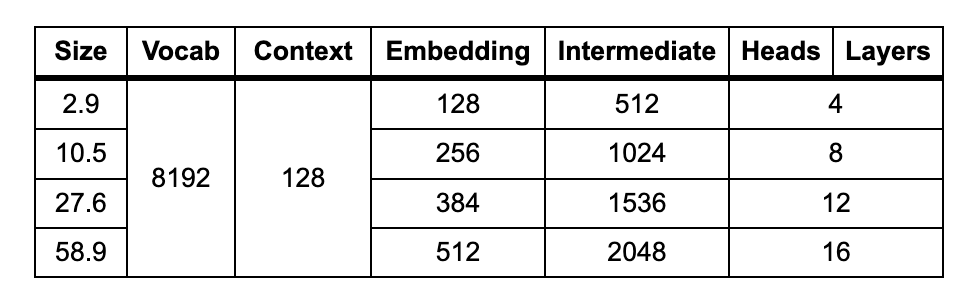
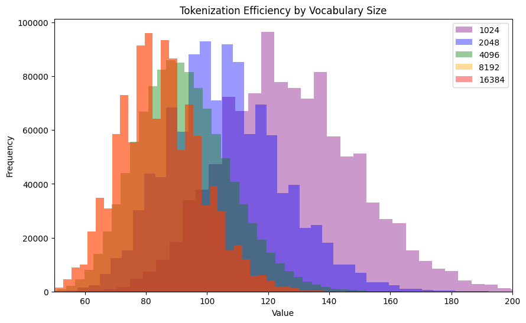
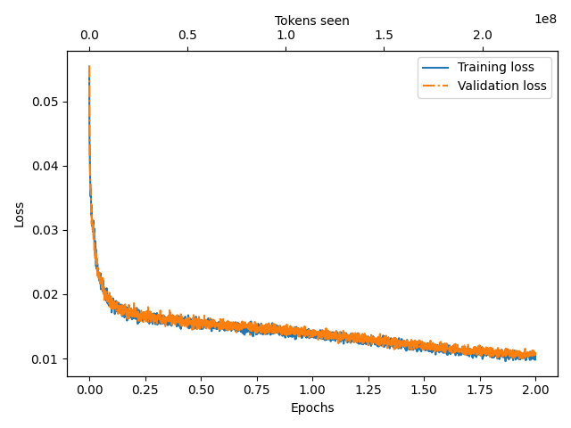
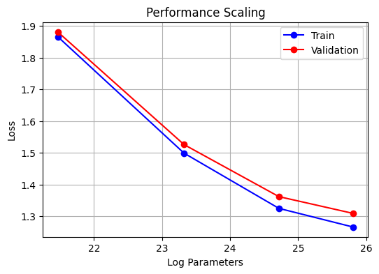
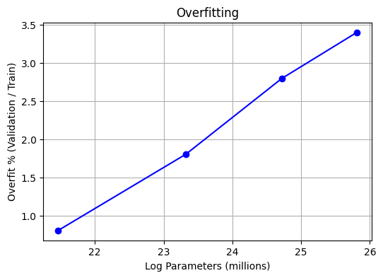
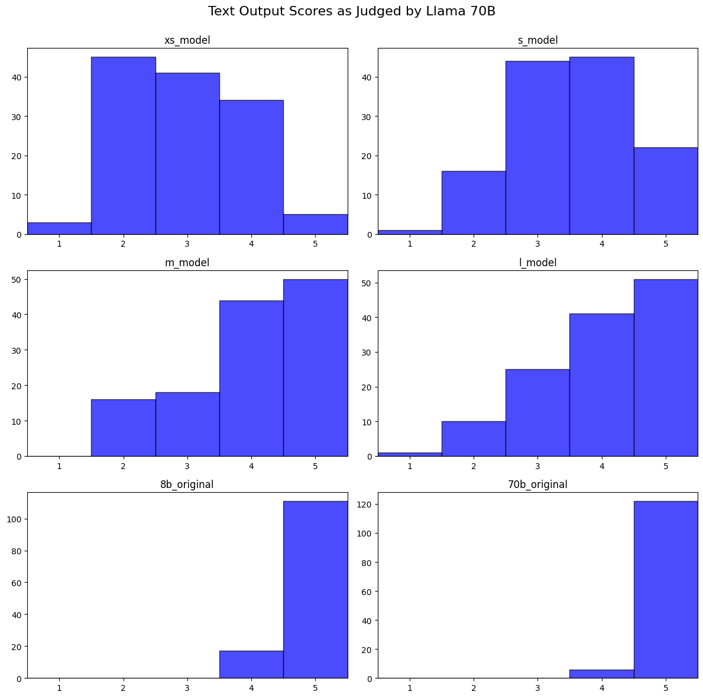
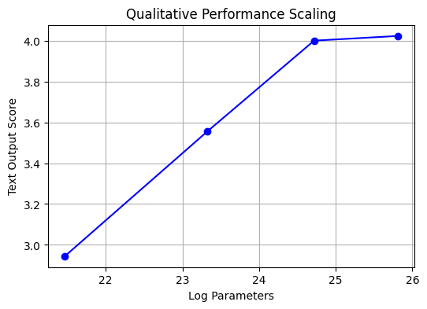
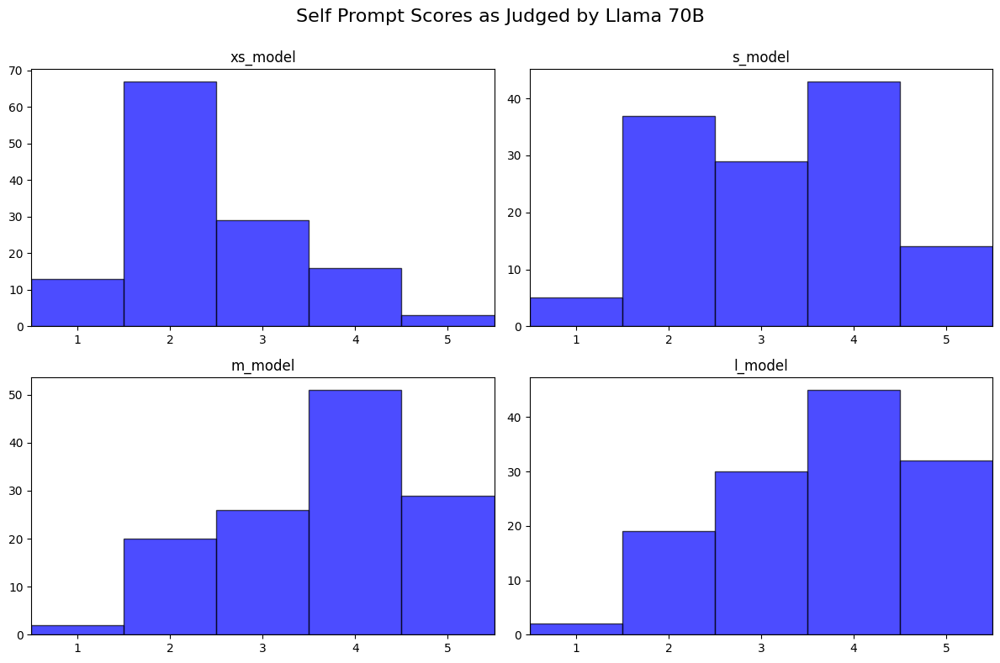

<div style="display: flex; align-items: flex-start;">
  
  <div>
    TinyNews is a collection of one million synthetically generated news bulletins and several language models scratch-trained on this data. Evaluation suggests that TinyNews retains ~80% of the quality of the training data while using 100s of times fewer parameters than the models used to generate it. <br><br>
    Trained models and training data are available on <a href="https://huggingface.co/collections/GregSamek/tinynews-668aff540bf195d6e5e0e40f">🤗 Hugging Face</a><br><br>
    The code for this project can be found on <a href="https://github.com/gregsamek/TinyNews">Github</a><br><br>
    This project is essentially a modified reimplementation of the Microsoft Research <a href="https://arxiv.org/abs/2305.07759">TinyStories</a> project.<br><br>
    TinyNews also borrows heavily from Sebastian Raschka's excellent book <a href="https://www.manning.com/books/build-a-large-language-model-from-scratch">Build a Large Language Model (From Scratch)</a><br><br>
  </div>
</div>

## Introduction

Over the last couple of years, I've prompt-engineered, fine-tuned, and quantized existing open source LLMs. But I've been unable to get the idea out of my head that I should train my own model competely from scratch. Anyone in their right mind will tell you that training your own Large Language Model is a stupid idea - but that's only true if you think you're going to replace ChatGPT or Claude. I have no such illusion. My goal for this project is to learn. I want to verify that I can implement each step of the process. If it works for millions of parameters, I know it would scale to billions and that's good enough for me.

One option is to [reproduce GPT-2](https://www.youtube.com/watch?v=l8pRSuU81PU), training a ~100M model on a sampling of web text. It's rare to to see open source projects bother to release [models](https://huggingface.co/EleutherAI/gpt-neo-125m) of this [size](https://huggingface.co/facebook/opt-125m). It's accepted that models this small are effectively useless in their own right, at best adding an additional point to an architecture's scaling curve. But there is an open source project that trained models even *smaller* than this and showed that they can produce viable (if limited) text...

The motivation of the TinyStories project was to push the limits of how small a GPT-like language model can be while still producing coherent text. To accomplish this, the researches leaned into the limitations. Rather than training a general purpose model on a diverse collection of web text, they used chatGPT to generate a synthetic dataset exclusively comprised of children's short stories. They demonstrated that even models ~10M parameters in size are capable of producing logically consistent stories with correct grammar.

At the scale of TinyStories, training is practically [free](https://sunyan.substack.com/p/the-economics-of-large-language-models). Nearly all the cost would come from creating synthetic data. Some quick napkin math tells me that a ~10M parameter model should probably train on a ~100M token dataset. Because the text will be simple, I should be able to generate it using a model like Llama 3 8B, which costs ~$0.10 per M tokens. This means I can generate my data for only ~$10. If I further assume my samples will be short, ~100 tokens each, this means I should generate ~1M unique samples.

## Model Configuration

TinyNews models closely follow the GPT-2 architecture. While some LLM improvements have become adopted since GPT-2, I believed them to be unlikely to contribute much value to this particular project, instead favoring simplicity. These models are already so small that the speed-up from [Grouped Query Attention](https://arxiv.org/abs/2305.13245) is unnecessary. [Rotary Positional Encoding](https://blog.eleuther.ai/rotary-embeddings/) is likewise overkill, as my synthetic training examples have a consistent (and short) length.

TinyNews was trained at four sizes, shown in the chart below (size in millions of parameters):



The vocabulary size and context length were determined after tokenizing the training data, discussed in a later section. These parameters are held constant across all models. 

With each doubling of the embedding dimensions, the number of layers is also doubled. The width of the intermediate Feed Forward layers was always defined as 4 * Embeddings. I decided to scale the number of attention heads with model size, so that the dimensions of each head remained constant at 32. This also means that for each model the number of layers happens to equal the number of heads.

## Training Data

How do I expect ~10 million parameters to produce anything other than gibberish? By training on an *extremely* focused dataset. TinyStories models were trained on nothing but [children's stories](https://huggingface.co/datasets/roneneldan/TinyStories/viewer/default/train?p=2&row=206) written in English with the vocabulary of a 3-year-old. The models do not write javascript or french poetry. They aren't attempting to compress web-scale data.

Like TinyStories, all of my training data was generated synthetically. Instead of fictional stories, my data consists of short news bulletins featuring a headline and a few sentence story summary. These are the kinds short reads you might hear on a radio station doing a news roundup:

> **city council decides on scrapping old building**
>
>the city council has decided to scrap an old building that has been standing vacant for years. the building, which was once a hub of activity, has fallen into disrepair and is now seen as an eyesore. the council has deemed it too expensive to renovate and has decided to tear it down. the decision has been met with mixed reactions, with some people sad to see the building go and others relieved that it will be replaced with something new. the city is already making plans for what to do with the empty lot.

The stories have a straightforward logical structure that I believed could be learned by a small model. I also liked that the headline of a story serves as an "attention sink" that grounds the entire bulletin. Headlines essentially act as an implicit instruction prompt.

### Vocabulary

I decided to be more aggressive than TinyStories with the vocabulary used in my data. My instructions were to use the vocaulary of a 6th grader as opposed to a preschooler. I thought it was unnecessary to explicitly write them for children, instead requesting simple, direct prose.

Probably my most original idea from this project was to minimize the appearance of long tail tokens by specifically instructing the model not to use proper nouns. I reasoned that one-off names of fictional poeple, products, businesses, etc would be undertrained and diminish quality. This also meant that common nouns e.g. "businessman" would be sampled even more frequently and give the model the best opportunity at learning a good representation.[^1]

### Seeding

When generating millions of samples, you can't just rely on temperature to create a diverse dataset. Instead, I seed my generations. TinyStories used a pretty simple seeding strategy of selecting three words - one noun, verb, and adjective - from a list of 1500 basic english words. These three words are then incorporated into one story. 

I think this was a good approach for TinyStories. The combinatorics make for a huge number of possible combinations and because the final product is a fictional story that can contain fantastical elements, even improbably combinations of words can still make for a plausible output. In hindsight, I probably should've just stuck to this simple approach. But I wanted to do things differently than TinyStories when possible, and so I took an approach that admittedly may be a bit overengineered.

To create a list of seed words, I referenced [word frequencies](https://simple.wiktionary.org/wiki/Wiktionary:BNC_spoken_freq) of the British National Corpus, and added a further few hundred words by cross referencing other "common words" lists. This gave me a list of ~4,500 "headwords" (hack) and ~20,000 word forms (hacked, hacker, etc). 

There was a high variance of word forms per headword. A word like "rural" only has one form. But a headword like "obsess" can be used as a verb, an adverb (obsessively), a noun (obsession), an adjective (obsessive), not to mention different tenses. This means that if I sampled from the list of 4,500 headwords, I would be undersampling words with many forms, potentially making them difficult to learn. Ideally, my tokenizer would learn common word fragments and break a word like "obsessive" into something like "_obsess" and  "ive" and the language model would learn a good embedding for "obsess" that is shared between every form of the word.[^2] Rather than sample from the list of all 20,000 word forms, I split the difference by chunking headwords into [9,680 lists](https://github.com/gregsamek/TinyNews/blob/master/vocabulary.json) of no more than three words:

>["obsess", "obsesses", "obsessing"], ["obsessed", "obsession", "obsessions"], ["obsessive", "obsessiveness", "obsessively"]

One epoch of data generation would entail sampling from each of these 9,680 lists exactly once. That means that for each epoch, there would be (at least) three news bulletins that incorporated the "obsess" headword, as opposed to either one or nine bulletins if I had not used this chunking strategy.

### Data Generating Models

Data was generated with the Llama 3 8B and 70B models, via [openrouter](https://openrouter.ai/). I found that the 70B model produced good results even without any examples, and I could safely generate 20 bulletins per request (I probably could've pushed this even further but didn't feel the need). The 8B model required [few shot examples](https://github.com/gregsamek/TinyNews/blob/master/few_shot_examples.json) and could only safey produce 10 bulletins per request before it would break by repeatedly writing nearly identical bulletins.

I initially attempted to use JSON to format responses, but there was a high failure rate. I eventually settled on simply using HTML, as it gave the best results. Llama already understands HTML, and it maps well to my data - I'm literally just wrapping headlines in headline tags and paragraphs in paragraph tags!

> `<h1>Headline1</h1><p>Story1</p><h1>Headline2</h1><p>Story2</p>`

Llama 8 still occasionally produced broken HTML, but it was fairly easy to catch these with regex because they would fail in minor ways like failing to close a tag with '>'

## Tokenization

After parsing and cleaning the generated data, I made the decision to convert all text to lowercase. As with the previous decisions I've mentioned, this was done in service of making the data as easy as possible to learn. I'm much more interested in observing a model's ability to understand the meaning of words than its ability to capitalize the first word of a sentence. Capitalization would mean that "New" and "new" would be completely different tokens with different learned embeddings. 

The TinyNews tokenizer is a Byte Pair Encoder using the sentencepiece library. Four different vocabulary sizes were trained: 1024, 2048, 4096, 8192, and 16384. These were compared to several of OpenAI's pretrained tiktoken models. My custom tokenizer reaches virtual parity with the tiktoken models, but with an order of magnitude smaller vocabulary:

| Tokenizer |  Vocab  | Avg # Tokens |
|-----------|---------|--------------|
| TN-10     |   1,024 |    126.4     |
| TN-11     |   2,048 |    105.4     |
| TN-12     |   4,096 |     91.7     |
| TN-13     |   8,192 |     84.8     |
| TN-14     |  16,384 |     84.8     |
| gpt2      |  50,257 |     82.3     |
| gpt-4     | 100,277 |     82.1     |
| gpt-4o    | 200,019 |     81.6     |

Inspecting the tokenized training data, I see the diminishing returns of increasing the size of my vocabulary. The 16,384 is identical to the 8,192 model, so I use 8,192 to train my language models. A quick check revealed that ~99.8% of the news bulletins have 128 tokens or less, so I chose this as my context length.



### Special Tokens

My tokenizer includes four special tokens:

- [0] : Unknown
- [1] : BOS
- [2] : EOS
- [3] : `</h>`

BOS may at first seem unnecessary to include, but this allows the trained models to generate news bulletins completely on their own, without passing in a headline. Additionally, this token can still act as an attention sink and play a more important role than one might think.

The `</h>` token is used to mark the end of the headline and is included to make it as easy as possible for the models to learn the structure of the data. 

## Training

Models were trained using Nvidia RTX 3070s rented via [runpod](https://www.runpod.io/). 

Models were trained for two epochs using the Adam optimizer, a linear warmup on 1% of the data, and a cosine decay curve. 

### Learning Rate

Before fully training each model, small training runs were performed at three different orders of magnitude to verify an appropriate peak learning rate. For three of the four models, 0.001 was determined to be superior to 0.01 and 0.0001. There was no further fine-grained search performed beyond this. 

The only model that initially seemed to deviate from this was the smallest 3M model, which achieved better results with a lr of 0.01 in my initial tests. However, when full training runs were attempted, even the 3M model achieved a much lower loss by training at a peak of 0.001. So in the end, *all four models were trained with the same peak lr of 0.001*. [Training logs](https://github.com/gregsamek/TinyNews/blob/master/results/trained_models) are available for each model, with the logs of the lr test runs available in the `/lr/` subfolders.

Training loss curves show the prototypical shape:



## Evaluation

The scaling chart shows that the TinyNews models don't quite achieve Log-Linear scaling. There are clearly diminishing returns. The most obivous explanation for this is that the models are saturating. The size of the training data itself is ~90 million tokens and the largest model is 59 million parameters. 



There is clearly a gradual increase in overfitting as the models get larger, which I think supports the saturation hypothesis.



Another possible contributor to the diminished returns may be the fact that each model's hyperparameters were not individually tuned as optimally as they could've been. The most obvious example of this is the peak learning rate, which was 0.001 for every model. It's possible this learning rate was better suited to the smaller models, but was a bit too high to get the most out of the largest model.

### 70B as a Judge of Quality

How do these losses translate into actual text? Let's take a headline from the 70B validation data and feed it into each model with temperature=0:

>**Headline: family enjoys travelling around the world** 
>
>**extra-small 3M**
>
>a family has been enjoying the travelling around the world. they have been enjoying the sights and sounds of the sights and sounds of the sights. the family is grateful for the opportunity to explore the world and learn about the world. the family is grateful for the opportunity to spend time together and make new memories
>
>**small 11M**
>
>a family has been enjoying a trip around the world, enjoying the beautiful scenery and company of their trip. the family has been planning their trip for months, and they have been taking in the sights and sounds of the world. the trip has been a huge success, and the family is grateful for the opportunity to spend quality time together. they are already planning their next trip
>
>**medium 28M**
>
>a family of four has been traveling around the world for several months, enjoying the beautiful scenery and each other's company. they have been traveling for over 10 years, and have seen many different cultures and places. the family is grateful for the opportunity to spend time together and is planning a trip to the country. they are excited to see what the future holds and are looking forward to many more adventures
>
>**large 59M**
>
>a family of four recently went on a trip to a foreign country and enjoyed a relaxing vacation. they spent their days hiking and exploring the beautiful scenery. the trip was a great way for the family to bond and create new memories. they are already planning their next trip
>
>**70B (original)**
>
>a family is enjoying travelling around the world, visiting new countries and experiencing different cultures. they have been on the road for months, and it's been the adventure of a lifetime. they are learning new languages, trying new foods, and making new friends. the family is documenting their journey on social media, and their followers are loving it. they still have a few more months to go before they return home

The smallest model clearly repeats itself - "the sights and sounds of the sights and sounds of the sights" is classic AI slop. Even still, it's at least using words and phrases - "explore", "make new memories" - that fit the context. The largest model is quite simple, but it's grammatically correct, it's logical, and it was written by a model with literally 1,000x fewer parameters than the original!

To quantify the text quality, I again used Llama 3 70B - this time as a judge. I asked the judge to consider how well the news bulletin matched the headline, the logical coherence of the prose, grammatical and semantic correctness, etc. I also made the judge aware of the instructions used during generation so that they would not be penalized for their simplistic language. Finally, I instructed the model to first write notes before assigning a grade.

For all of these quality assessments, I use a sample size of 128. To begin, I established a baseline for the original 8B and 70B validation data. To my surprise, there was not a statistically significant difference between the models at this sample size.

```
  8b_original: 4.867
 70b_original: 4.953
      p-value: 0.094
```

I next use the 59M model to briefly explore a couple of different inference parameters: temp=0, temp=0.5 with topk=16, and temp=1.0 with topk=32. I extract the headlines from the samples above, feeding them in as if they were prompts:

```
 8b_temp_0_topk_None: 3.945
 8b_temp_0.5_topk_16: 3.891
 8b_temp_1.0_topk_32: 3.426
70b_temp_0_topk_None: 4.023
70b_temp_0.5_topk_16: 4.125
70b_temp_1.0_topk_32: 3.484

0 Temp vs. 1 Temp p-value: 0.006
```
Quality seems to hold up for (0.5, 16), but clearly drops off at (1.0, 32). I decided I decided to use temp=0 with the 70B headlines to evaluate the remaining three model sizes:

```
 xs_model: 2.945
  s_model: 3.555
  m_model: 4.000
  l_model: 4.023
```



This quality scaling curve shows a similar story as the earlier loss scaling curve. Here, the increase from 3M to 11M to 28M is almost perfectly Log-Linear, but there's no significant difference between the 28M and 59M models.

On the bright side, even the 28M model scores a solid 4/5, meaning that we've reached ~80% of Llama 8B performance with ~300x fewer parameters!



There's one last thing to test. I trained the models with a BOS token, meaning that they're capable of generating *their own* headlines. Obviously performing this evaluation at temp=0 makes no sense, so I instead use the temp=1.0, topk=32 parameters from earlier:

```
 xs_model: 2.445
  s_model: 3.188
  m_model: 3.664
  l_model: 3.668
```
The 59M model scores slightly better with its own prompts, but this is not at all significant: 

```
l_model_self: 3.668
l_model_70B : 3.484
     p-value: 0.356
```



## Costs

This project cost ~$30 in total, but it should've cost ~$10. Nearly all of the cost was from generating the synthetic data, and most of *that* cost was the ~20% of my data that was generated by Llama 3 70B. I generated so much data with 70B because I had expected a larger difference in quality and had planned on doing some additional experiments that took advantage of that - for example first training on 8B data and then annealing on 70B data.

## Footnotes

[^1]: While this instruction was quite effective, there were some names that still slipped through the latent cracks - for example the model likes to name cats "whiskers". I imagine this happened because of some combination of the name being given to an animal instead of a human and whiskers being primarily used as a common noun.

[^2]: In practice, my tokenizer turns "obsess obsessively obsession obsessive" into ['▁obs', 'ess', '▁obs', 'ess', 'ively', '▁obs', 'ession', '▁obs', 'ess', 'ive']
